# Group Project: Design Journey

**For each milestone, complete only the sections that are labeled with that milestone.** Refine all sections before the final submission.

You are graded on your design process. If you later need to update your plan, **do not delete the original plan, leave it in place and append your new plan _below_ the original.** Then explain why you are changing your plan. Any time you update your plan, you're documenting your design process!

**Replace ALL _TODOs_ with your work.** (There should be no TODOs in the final submission.)

Be clear and concise in your writing. Bullets points are encouraged.

Place all design journey images inside the "design-plan" folder and then link them in Markdown so that they are visible in Markdown Preview.

**Everything, including images, must be visible in _Markdown: Open Preview_.** If it's not visible in the Markdown preview, then we can't grade it. We also can't give you partial credit either. **Please make sure your design journey should is easy to read for the grader;** in Markdown preview the question _and_ answer should have a blank line between them.


## Client (Milestone 1)

### Client Description (Milestone 1)
> Tell us about your client. Who is your client?
> Explain why your client meets the client rules in the project requirements.

Our client is Ain't I A Woman?!, a national outreach campaign sponsored by nonprofit organizations, started by women garment workers, with the goal of ensuring sweatshop benefactors are held accountable.

Our client meets the client rules because they are an off-campus organization that needs a redesigned website. They are aware that the website will not be dymanic.

### Client Questionnaire (Milestone 1)
> Develop a client questionnaire to learn more about your client and their goals.
> You may use the questionnaire below, you may modify the questionnaire below, or you may create your own.

1. Describe your organization and its purpose.

We are Ain't I A Woman?!, a campaign to hold sweatshop benefactors accountable for their labor injustices. We are involved in multiple campaigns, from boycotting the Reynolds Group for their sweatshop conditions of forced overtime to demanding justice for garment workers working 24-hour shifts while being paid for 12. We serve the community, specifically New York City workers. We ultimately aim to protect workers in our community being taken advantage of by their bosses.

2. What makes your organization and its services special or unique?

Our niche within fighting sweatshops in NYC and specifically launching campaigns against these sweatshops is not very well-explored by other organizations. We are one of a small numbero of NYC campaigns specifically addressing labor abuse such as sweatshops.

3. Why are you looking for a new website or updating your existing site?

We are looking for a website refresh. The biggest issue is we post all new events on the homepage and so the "Scroll" has gotten really really long. We also want to improve the usability of the support/how to get involved/donate and make them more visible / accessible.

4. Who do you want to visit your site? Who do you believe is your website's intended audience?

We want any interested everyday person to be able to visit our site. We want to draw in interested activists, potential volunteers, and media personnel from the NYC area to spread our message.

5. When visiting your site, what actions do you want your visitors to take?

We want them to primarily learn about our events, our news, our campaigns, and our mission. We specifically want them to join our events and view the event posters.

6. What are your goals for this site?

We hope this site will spread our message and our organizing efforts / campaigns. We want to make this information more accessible to encourage greater participation and membership.

7. Is there a "feel" that you want for your site? Are there colors or imagery that you have in mind?

Something along the lines of our current site; we want a clean site that has similar font and blue shades.

8. What are your three favorite competitors or similar organizations' websites? Why?

We like the website NMASS (National Mobilization Against Sweatshops) has. We also think that the feel of Chinese Staff and Workers' Association's website is good. We like the NYC Democratic Socialists of America page as well.

### First Client Meeting Minutes/Notes (Milestone 1)
> Include your notes/minutes from your first meeting with your client.

- "Scroll" of the homepage has gotten really long - we want to make it more usable
- Content is word heavy

Added notes that were forgotten to write down:

- Want a simplified website, with just the Testimonials, Contact Us, Who We Are, and Campaigns pages
- Most important part of the website redesign is the homepage
- First meeting was 20 minutes long

### Client Website (Milestone 1)
> Tell us about the website that your client wants.
> Tell us the purpose of the website and what it is all about.
> Note: **If you are redesigning an existing website, give us the current URL and some screenshots of the current site.** (FireFox makes it easy to take a full screenshot of a page from the context menu (right click).)
> If you are redesigning an existing site, tell us how you plan to update the site significantly that meets the project's requirements.

Our client wants a more refined, less word-heavy, and less scroll-heavy homepage. They also want a general website design refresh to make it more accessible. The existing URL is: [Ain't I A Woman?! website](https://www.aintiawoman.org/).

Screenshots of the website:
- 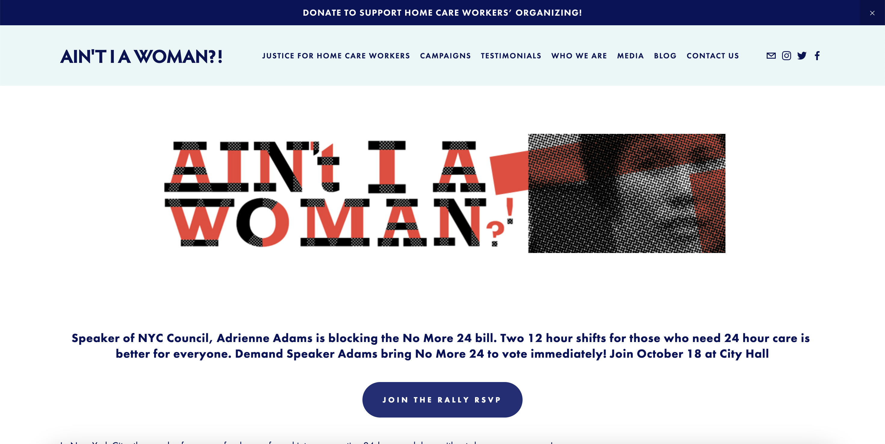
- 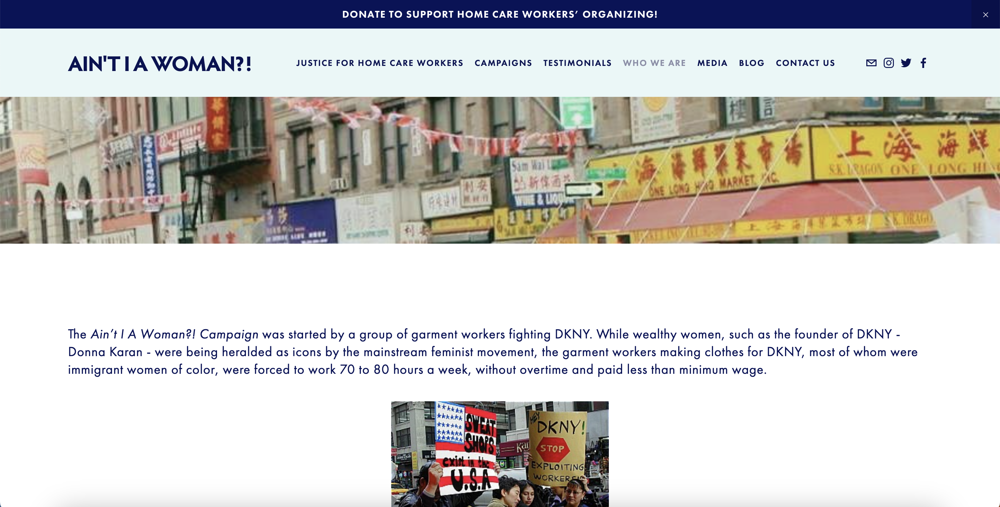
- 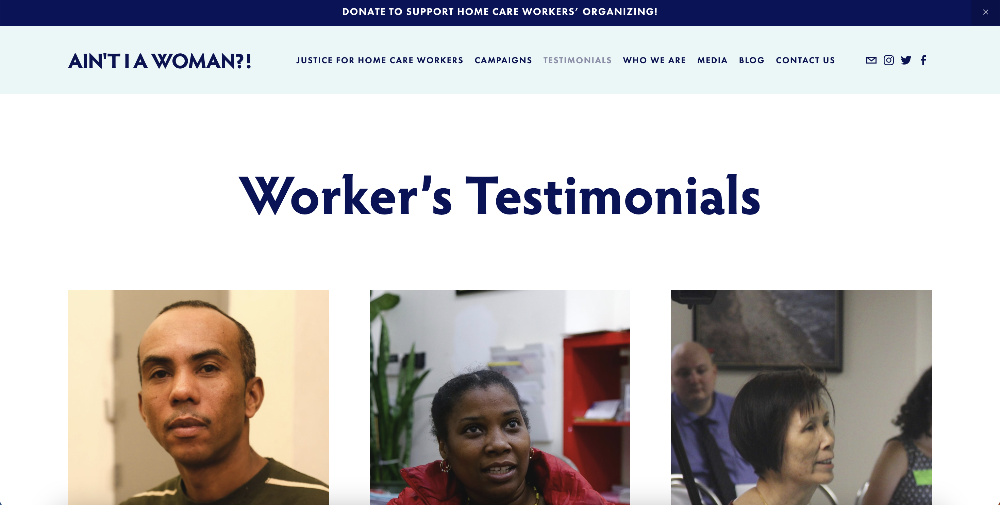
- 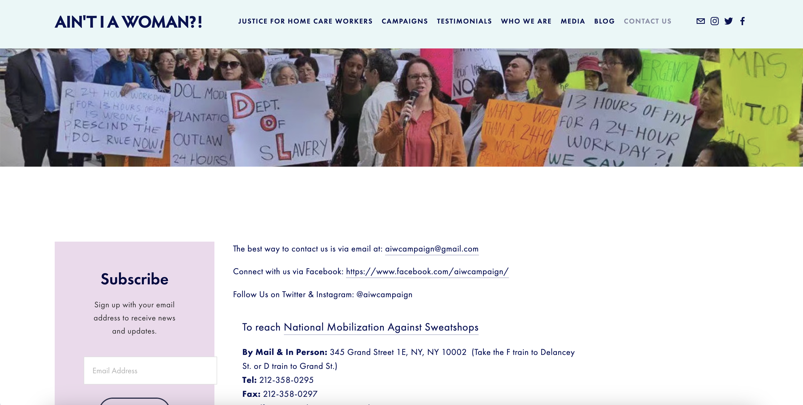
- 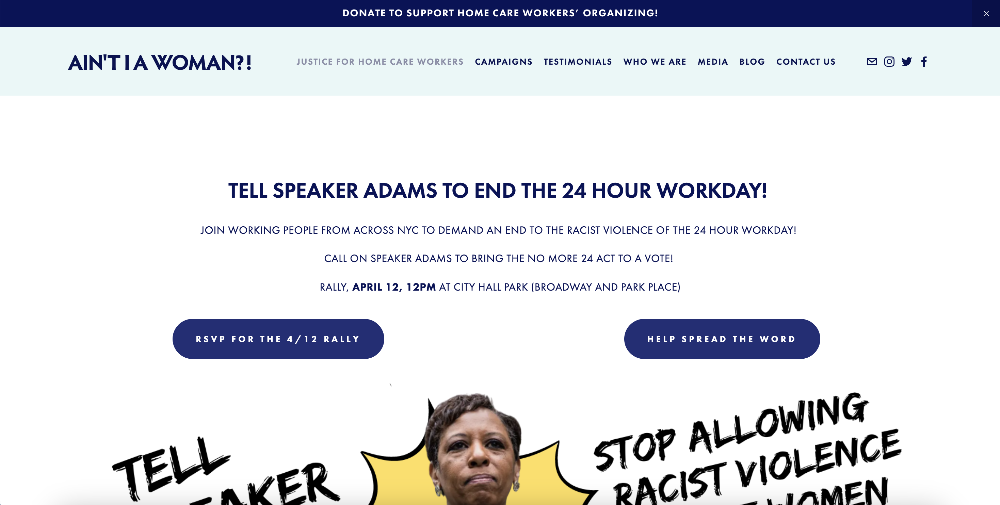

### Client Goals (Milestone 1)
> Identify your client's goals for the website.
> What kind of website do they want? What are their goals for the site?
> There is no required number of goals. You need as many goals as necessary to reflect your client's desires.

- Address the long homepage scroll
- Improve the visibility and accessibility of support, involvement, and donation options
- Increasing the viability of joining as a member
- Increase the accessibility of Learn about their events and stay updated with their news
- Engage with their campaigns activity, making comments and community interaction more viable
- Understand their mission, making the mission statement, events and posters clear and obvious
- Encourage users to join events and View event posters
- Clean design
- Similar fonts to their current site
- Blue color shades

### Client Website Scope (Milestone 1)
> We want your project to be successful! It needs to be ambitious, but not too large.
> A good rule-of-thumb is that you should have about 1 content-full page for each team member.
> Explain why the website you will create for your client isn't too small and isn't too big.
> Explain why you think it's the right size for this project.

We are creating a consolidated version of their current website. We will implement the homepage, the Justice For Home Care Workers page, the Campaigns page, the Testimonials page, the Who We Are page, and the Contact Us page. This is not too small, as we have multiple full-content pages in our scope; this is not too big because most of the pages can be consolidated and thus the workload will be suitable for a team of four. By consolidating the current website content according to the client's needs / requests, we will highlight desired actions and make important information more accessible. Additionally, since it is a redesign, the content existing already contributes to the scope not being too difficult.

Note: we are not implementing the pages in which they are currently displayed, we are eliminating content that the client has deemed unnecessary or that they don't want on their page anymore.

## Plan/Schedule (Milestone 1)
> Make a plan of when you will complete all parts of this assignment.
> This plan is for your team. There is no required format. Format it so that it works for you!
> Your plan should include when you will interview users and analyze their goals.
> Your plan should also include how and when you will assemble/create the sit's content.
> **Tip:** Your team should plan to work ahead. This project really isn't feasible to complete the night before a deadline.

We have created a google calendar which outlines our meeting times and deadlines in detail: [Link to calendar](https://calendar.google.com/calendar/u/0?cid=YTg3YTMyNzg4OWY2ZDBlODU4YjE4NmIxNWQ4ODc1ODY5YmZkZWMwMDkxYmRmNTQ0NjhlM2YzN2QxNzYxZjY1OEBncm91cC5jYWxlbmRhci5nb29nbGUuY29t)

Here is a brief summary of our schedule:

- Weekly meeting times every Tuesday to work
- By Oct 31st: design info architechture and basic css
- By Nov 7th: Add more css and intercativity
- By Nov 14th: Do a final check for milestone 2 and submit
- By Nov 21st: Revise website and do user testing
- By Nov 28th: Make final revision and submit

## Understanding Users (Milestone 2)

**Make the case for your decisions using concepts from class, as well as other design principles, theories, examples, and cases from outside of class.**

You can use bullet points and lists, or full paragraphs, or a combo, whichever is appropriate. The writing should be solid draft quality, but it doesn't have to be fancy.


### User Interview Questions (Milestone 2)
> Plan the user interview which you'll use to identify the goals of your site's audience.
> You may use the interview template below and revise it as much as you desire.

**User Interview Briefing & Consent:** "Hi, I am a student at Cornell University. I'm currently taking a class on web design and for a project, I am designing the website for Ain't I A Woman?!. I'm trying to learn more about the people that might use this site. May I ask you a few questions? It will take about 10 minutes. You are free to quit at any time."

1. Please tell me a bit about yourself. You may omit any personal or private information
2. Take me through your most recent process of locating event information on a website. Please be as specific as you can
3. Take me through your most recent process of locating membership information on a website. Please be as specific as you can
4. Think back to the last time you were interested in a cause or an organization, and researched them. What was the information you were mainly searching for? If you had any others, what were they?
5. Thinking back to the last time you viewed a website, when you first reach a homepage, what is your first course of action?
6. Recall a time you had a positive experience navigating a website. Which features in particular contributed to that positive experience?
7. Similarly, recall a time you had a negative experience navigating a website. Which features in particular contributed to that negative experience?
8. Have you ever used the Ain't I A Woman?! (AIW) site? Recall the last time you used the AIW site, if you have. How did you feel about your experience on the page? Did you access your information quickly? Please take me through the overall journey you took on the page to the information.
9. If you could change one thing about the AIW page, if you have been on it, what would you change?
10. What is your most frequent use of the AIW page, if you have been on it?
11. What haven't I asked you today that you think would be valuable for me to know?

**After the interview:** "This was really helpful. Thank you so much for agreeing to speak with me today. Have a great day!"

### Interview Notes (Milestone 2)
> Interview at least 1 person for every member of your team from your audience.
> Take notes and include those notes here. Make sure to include a brief description of each interviewee.
> **Copy the interview questions above into each interviewee section below.**
> Take notes for each participant **inline** with the questions.

**Interviewee 1:**

My first participant is Aidan, a student at Binghamton University.

1. Please tell me a bit about yourself. You may omit any personal or private information

- Medium level introvert
- Likes soccer and video games and collecting Pokemon cards
- Lives in Brooklyn, NY with family and dog

2. Take me through your most recent process of locating event information on a website. Please be as specific as you can

- For concert tickets
- Googled the concert name + location
- Clicked Ticketmaster link

3. Take me through your most recent process of locating membership information on a website. Please be as specific as you can

- Subscribed to an expensive service for card grading
- Wanted to cancel it and was looking for the button to do it but there was no button in "My Account"
- Tried to Google but it didn't show up
- Tried to call but wasn't responsive
- Gave up and asked friend to do it

4. Think back to the last time you were interested in a cause or an organization, and researched them. What was the information you were mainly searching for?

- Binghamton trading card club
- Wanted to join; tried to look them up after the QR code didn't work
- Went to a Facebook page but the page seemed old so clicked on links and got led back to the page that linked to the previous page

5. Thinking back to the last time you viewed a website, when you first reach a homepage, what is your first course of action?

- Ebay; first thing: typed in search for the thing looking for; then endlessly scrolled

6. Recall a time you had a positive experience navigating a website. Which features in particular contributed to that positive experience?

- Been a while since that happened
- Youtube: video recommendation is good so don't have to look too far; search result is accurate to what you want

7. Similarly, recall a time you had a negative experience navigating a website. Which features in particular contributed to that negative experience?

- School college class roster
- Forced authentication to get in and is annoying
- Trademarked by Binghamton image blocks the button to search for class results

8. Have you ever used the Ain't I A Woman?! (AIW) site? Recall the last time you used the AIW site, if you have. How did you feel about your experience on the page? Did you access your information quickly? Please take me through the overall journey you took on the page to the information.

- I have not.

9. If you could change one thing about the AIW page, if you have been on it, what would you change?

- I haven't used it.

10. What is your most frequent use of the AIW page, if you have been on it?

- I have not.

11. What haven't I asked you today that you think would be valuable for me to know?

- I think that websites should have better UI - a lot of websites are unnecessarily archaic and old-looking
- Class-picker example: need a way to go back to the previous page / previous step without having to go back via the browser

**Interviewee 2:**

My second participant is Espy, a volunteer at NMASS (National Mobilization Against Sweatshops) and high school student at Townsend Harris High School in New York City.

1. Please tell me a bit about yourself. You may omit any personal or private information

- High school student interested in political science and history
- Activist
- Enjoys baking
- Plays the piano

2. Take me through your most recent process of locating event information on a website. Please be as specific as you can

- Tried to find information for a Japanese food festival in the city
- Looked up the name of the festival, then clicked on the right result, then went to the homepage, found the information right on the homepage

3. Take me through your most recent process of locating membership information on a website. Please be as specific as you can

- Cannot recall looking up membership information

4. Think back to the last time you were interested in a cause or an organization, and researched them. What was the information you were mainly searching for?

- Interested in CSWA (NMASS' sister organization)
- Went to their website
- Looked through their homepage
- Then looked through their "about" page

5. Thinking back to the last time you viewed a website, when you first reach a homepage, what is your first course of action?

- Typically read halfway down the landing page and then determine if the page is relevant to search
- If relevant, then continue; if not, stop and leave page

6. Recall a time you had a positive experience navigating a website. Which features in particular contributed to that positive experience?

- The Apple store website has cool animations / scrolling

7. Similarly, recall a time you had a negative experience navigating a website. Which features in particular contributed to that negative experience?

- The NYS absentee voting website is very ancient looking
- It also has too many things on the screen which overwhelms me

8. Have you ever used the Ain't I A Woman?! (AIW) site? Recall the last time you used the AIW site, if you have. How did you feel about your experience on the page? Did you access your information quickly? Please take me through the overall journey you took on the page to the information.

- Yes, is a member
- It was difficult to read all of the text
- Too much scrolling and text too small
- The images were too big to read
- Information was hard to locate because there was too much of it

9. If you could change one thing about the AIW page, if you have been on it, what would you change?

- Would change the amount of text or the size of it on the homepage

10. What is your most frequent use of the AIW page, if you have been on it?

- To check events and RSVP to them

11.  What haven't I asked you today that you think would be valuable for me to know?

- Nothing comes to mind

**Interviewee 3:**

Fiona is a resident of Bayside, Queens. She is an activist and enjoys listening to music.

1. Please tell me a bit about yourself. You may omit any personal or private information

- Workers' rights advocate
- Personal trainer
- Lives in Bayside

2. Take me through your most recent process of locating event information on a website. Please be as specific as you can

- Drone show website
- Tried to find when the drone show was going to start
- Found on the homepage

3. Take me through your most recent process of locating membership information on a website. Please be as specific as you can

- Looked to cancel Planet Fitness membership. Went to a page regarding "memberships" / profile

4. Think back to the last time you were interested in a cause or an organization, and researched them. What was the information you were mainly searching for?

- Interested in Peloton bikes
- Searched their name, then clicked on their website, found the information on their homepage
- Wanted to know what they did and their cost

5. Thinking back to the last time you viewed a website, when you first reach a homepage, what is your first course of action?

- Scan the page for the information needed
- Go to the place where the information is

6. Recall a time you had a positive experience navigating a website. Which features in particular contributed to that positive experience?

- Liked that Nike's website has a navigation with all of the categories of clothes
- Quick and easy to find and get to

7. Similarly, recall a time you had a negative experience navigating a website. Which features in particular contributed to that negative experience?

- Was trying to find clothes on Ebay but the interface is very outdated, clunky, distracting, and confusing

8. Have you ever used the Ain't I A Woman?! (AIW) site? Recall the last time you used the AIW site, if you have. How did you feel about your experience on the page? Did you access your information quickly? Please take me through the overall journey you took on the page to the information.

- Yes
- Has used it to introduce people to the organization by showing the website
- Hard to find information and discern it from the rest
- Too much scrolling to get to information needed

9. If you could change one thing about the AIW page, if you have been on it, what would you change?

- The amount of text on the homepage
- Should differentiate the text sizes - small size is very hard to read
- Smaller poster image sizes

10. What is your most frequent use of the AIW page, if you have been on it?

- To show to others to expand outreach

11. What haven't I asked you today that you think would be valuable for me to know?

- Not sure, no comment


**Interviewee 4:**

Jordan, a Cornell sophomore studying Computer Science

1. Please tell me a bit about yourself. You may omit any personal or private information

- Name: Jordan
- From NYC
- Enjoys biking

2. Take me through your most recent process of locating event information on a website. Please be as specific as you can

- Looked for art exhibition updates (times) on their website
- Found the location and time at the header

3. Take me through your most recent process of locating membership information on a website. Please be as specific as you can

- Curious about Bronx Zoo membership
- Found the information under their "membership" section

4. Think back to the last time you were interested in a cause or an organization, and researched them. What was the information you were mainly searching for? If you had any others, what were they?

- Can't remember

5. Thinking back to the last time you viewed a website, when you first reach a homepage, what is your first course of action?

- Scan landing page and poke around for a couple minutes and then leave

6. Recall a time you had a positive experience navigating a website. Which features in particular contributed to that positive experience?

- Cornell course roster
- Liked the landing page a lot (ability to see all different course codes or search via another category if you need)

7. Similarly, recall a time you had a negative experience navigating a website. Which features in particular contributed to that negative experience?

- Documentation of Pandas code
- Not very easy to differentiate the examples from the description / links

8. Have you ever used the Ain't I A Woman?! (AIW) site? Recall the last time you used the AIW site, if you have. How did you feel about your experience on the page? Did you access your information quickly? Please take me through the overall journey you took on the page to the information.

- Hard to read
- Otherwise pleasant

9.  If you could change one thing about the AIW page, if you have been on it, what would you change?

- Text is really small on landing page

10. What is your most frequent use of the AIW page, if you have been on it?

- For researching campaigns to be educated on what is going on

11. What haven't I asked you today that you think would be valuable for me to know?

- Websites have become much more aesthetically pleasing but at the cost of usability

### Goals (Milestone 2)
> Analyze your audience's goals from your notes above.
> List each goal below. There is no specific number of goals required for this, but you need enough to do the job (Hint: It's more than 1 and probably more than 2).

Goal 1: find the information being sought after as soon as possible

- **Design Ideas and Choices** _How will you meet those goals in your design?_
  - We will ensure that the most important and common information is on the home screen by consulting the client with what content is most important and what can be placed in a different page.
  - Ensure the user is not scrolling too much
- **Rationale & Additional Notes** _Justify your decisions; additional notes._
  - By putting only the most common and most important information to users on the homepage, the time spent sifting through information will be lessened and it will be quicker for users to get to what they are seeking. By moving content into other pages, it will be easier to locate information because it will be more well-grouped.

Goal 2: Easily differentiate content on the page

- **Design Ideas and Choices** _How will you meet those goals in your design?_
  - We will utilize design principles (alignment, making the heading / subtitle larger than the text below it) to actively demonstrate which information belongs to which idea / category on the page
- **Rationale & Additional Notes** _Justify your decisions; additional notes._
  - By doing so, we will indicate via visual design which information is relevant to what topic, making it easier for users to identify and differentiate information

Goal 3: Expand outreach by introducing others to the website

- **Design Ideas and Choices** _How will you meet those goals in your design?_
  - We will label sections of text in clear, non-AIW-specific language to make it easier for non-members and those unfamiliar with AIW to use the site
- **Rationale & Additional Notes** _Justify your decisions; additional notes._
  - By doing this, we will make the website easier to understand for someone who has not been familiar with the campaign before

Goal 4: Research campaigns to educate themselves

- **Design Ideas and Choices** _How will you meet those goals in your design?_
  - We will make the campaigns a page together
  - Make the page / text easy to read
  - Make it easy to find each campaign's information (links on the homepage and clearly labeled page names)
- **Rationale & Additional Notes** _Justify your decisions; additional notes._
  - By doing this, the user does not have to struggle to find information, since the relevant information for the campaigns will be grouped as well as readable. Additionally, multiple points of entry for the pages allows for easier accessibility of the pages.

### Audience (Milestone 2)
> Briefly explain your site's audience.
> Be specific and justify why this audience is a **cohesive** group with regard to your website.

This audience for this website includes people in the New York City area who seek to participate in a movement aiming to improve womens' worker rights across various industries. This audience represents a cohesive group since there are many ways for people to participate in the organization which ranges from simply learning more about the topic to leading campaigns and rallies. Thus, the website of this audeince is cohesive since it could anyone who is passionate about the worker rights and  women's rights, most likely from or around the area.


## Website Design Exploration (Milestone 2)

Identify three websites (preferably static websites) that exist today on the web to draw inspiration from. Please select websites that are similar to the website you wish to create.

Include two screenshots of the home page for each site: narrow and wide.

**We'll refer to these are your "example websites."**

1. [NMASS website URL](https://nmass.org/)

    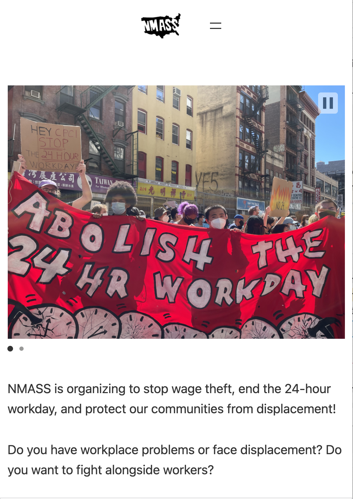

    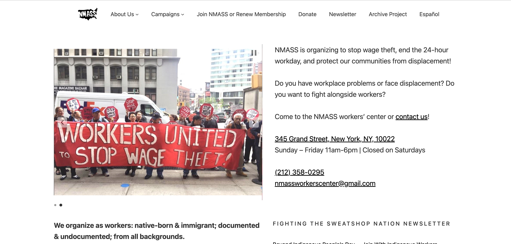

2. [Association to Benefit Children](https://www.a-b-c.org/)

    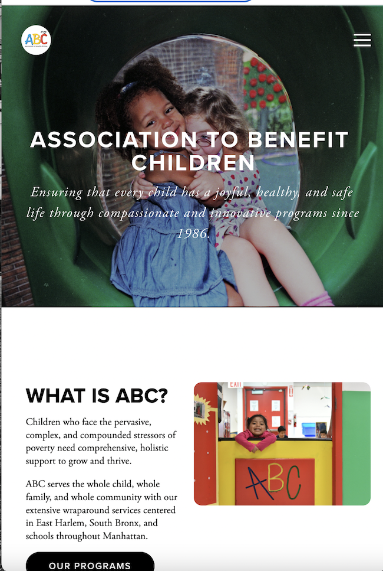

    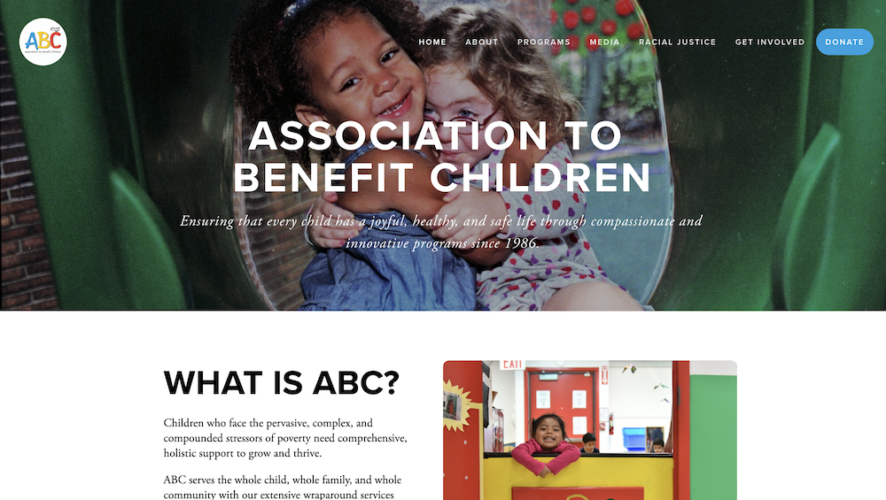

3. [Robinhood official website](https://robinhood.com/us/en/invest/)

    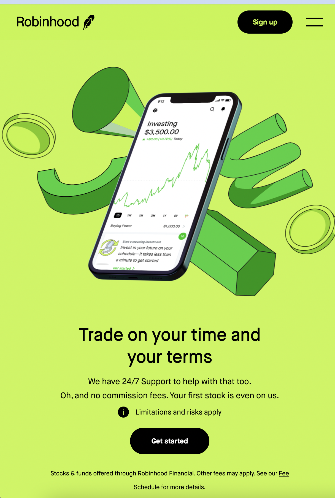

    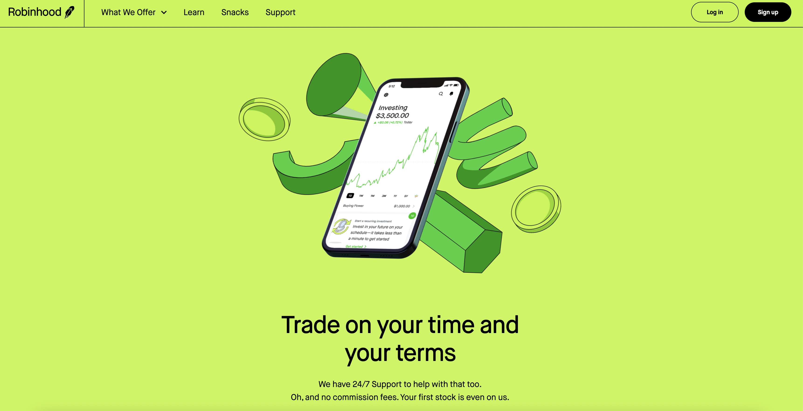


### Example Website 1 Review (Milestone 2)
> Review the website you identified above. (1 paragraph)
> In your review, include a discussion common design patterns and interactivity in the site.

The website employs many common design patterns and interactive elements. There is a carousel of pictures (able to click on the arrow to see another or click on the bottom part to see another). Additionally there is a button to indicate what can be interacted with / clicked on (affordance). There are different font weights and styles to denote a change in content / a title. The font is readable (accessibility). You can also hover certain parts of the nav bar to expand them (denoted with a down arrow - affordance). There is alignment down the middle of the page as well. This website is accessible and provides many affordances to indicate interactivity. However, the visual design is lacking, as there is a lot of whitespace in the bottom of the homepage. In the newsletter section, the images could also be center aligned as well, or the text could be placed next to the images. This would be visually more appealing so the bottom of the page is well aligned and it would also group the information well. There is a hamburger menu in the narrow screen width version; this interactivity involves a vertical navigation menu appearing when the icon is clicked. This interactivity is beneficial for the user to prevent unnecessarily long scrolling by hiding the menu when it is not needed.

### Example Website 2 Review (Milestone 2)
> Review the website you identified above. (1 paragraph)
> In your review, include a discussion common design patterns and interactivity in the site.

This website is for a non-profit dedicated to improving kids' education and features common design patterns for both wide and narrow screens. For wide screens, it utilizes a left-aligned logo and a horizontal navigation bar, providing a easily navigable layout. The stacked navigation bar appears on the narrower screen as a clickable hamburger menu which is an example of both design and interavctivity commonly seen on smaller screens. Interactivity is also present through buttons with distinct colors that guide users and act as affordances. Additionally, many of the pages feature  a gallery with clickable images that lead to different social media posts which helps enhance user engagement. While the theme of the site is eye-catching and visually interesting, the use of several different fonts throughout may be a bit distracting and make it more difficult to read some information. Overall, however, the site effectively conveys its message and seems to meet their audience goals throught interactivity and the use of familiar designs.


### Example Website 3 Review (Milestone 2)
> Review the website you identified above. (1 paragraph)
> In your review, include a discussion common design patterns and interactivity in the site.

This website is specifically designed as a platform for Robinhood's product launch and advocacy efforts, targeting individuals who possess a basic understanding of investment principles and seek to gain a deeper understanding of the advantages offered by Robinhood. The wide-screen layout of the site prominently features expansive color zones, oversized fonts, and large images, all aimed at making a significant impact on the audience. The high-contrast design instills confidence and a sense of trustworthiness in users, fostering a feeling of accuracy. Interactive elements are strategically incorporated to facilitate the sorting of various types of information, allowing users to engage directly with images and diagrams on the page to gain a comprehensive understanding of the products offered. On narrower screens, the design conceals excess elements within a collapsible burger-style menu for quick access, ensuring that critical advertising-related information pertaining to products and premium access remains unobstructed.


## Content Planning (Milestone 2)

Plan your site's content.

### Your Site's Planned Content (Milestone 2)
> List **all** the content you plan to include your website.
> You should list all types of content you planned to include (i.e. text, photos, images, etc.)
> Briefly summarize the content; do not include the content here.

- Text about the 24-hour campaign / Justice for Homecare workers
- 24-hour campaign poster image
- Council Christopher Marte poster image
- How you can help text
- Justice for homecare workers timeline
- How to get involved text section
- About AIW text
- Sign our petition text / link
- Donate link
- Subscribe link
- Ron Kim report link
- About homecare workers text
- About Pactiv Boycott text
- Figure of "More hours, less pay?!"
- Links to Pactiv films
- About text for Zheng vs. Liberty Apparel
- Timeline for Zheng vs. Liberty Apparel
- Image + testimonial for each person in the testimonials page
- What is the AIW campaign text
- AIW's Analysis text
- History of AIW text / timeline
- Manufacturer accountability text
- List of sponsors
- List of endorsers
- Contact information

### Content Justification (Milestone 2)（s）
> Explain (about a paragraph) why this content is the right content for your site's audience and how the content addresses their goals.

The content we chose is the most relevant and important to our users. From our user interviews, we deduced that main uses for the site were to educate someone or the user on the activities of AIW, especially those who are new to the site / cause. Thus, we placed priority on introductory content (such as "about" pages for AIW and their campaigns) as well as contact information. This would be good for users' goals of knowing more about AIW, their work, and how to get involved. Since many use cases for the site are to introduce AIW to new people, this introductory content would be well-suited for these new users' goals of understanding the campaign's story and message.

## Information Architecture (Milestone 2)

### Content Organization (Milestone 2)
> Document your **iterations** of card sorting here. You must have at least 2 iterations of card sorting.
> Include photographic evidence of each iteration of card sorting **and** description of your thought process for each iteration.
> Please physically sort cards; please don't try and do this digitally.

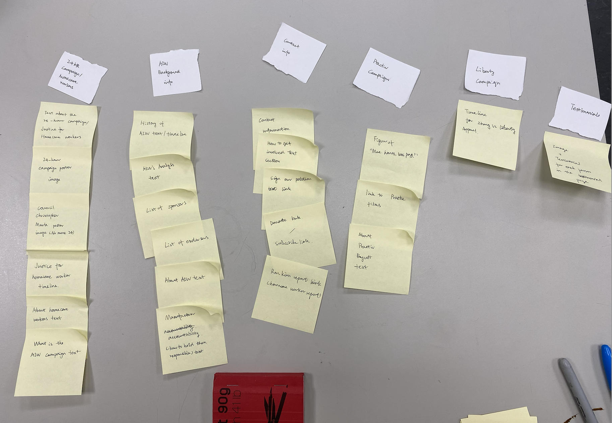

In the first iteration, the primary focus lies in organizing content according to the user's specific interests. This entails categorizing information related to specific previous case studies, delving into the club's history, and establishing the relevance of testimonials to the overall campaign. Within this sorting process, there are distinct categories, with one dedicated to contact details encompassing everything from the 24-hour camping hotline to more general facility contact information. This hierarchy ensures that users can easily access the specific details they require while also providing broader contact information when needed.

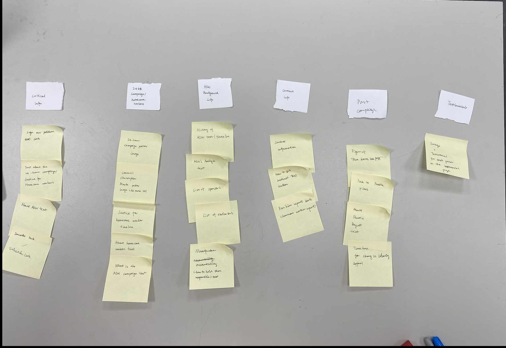

In the second iteration, the content is structured according to a user's typical information hierarchy, akin to the way one reads a poster or advertisement. At the forefront, the critical details, including timing, location, and key campaign information, are positioned on the first level to ensure immediate visibility. The second level contains information related to the 24-hour campaign and background details about AIW, offering users a more comprehensive understanding of ongoing events and encouraging them to engage further. Detailed contact information is placed on the third level for easy access. Finally, background information and testimonials reside on the fourth level, aiming to provide users with deeper insights into past events and their outcomes, thereby enhancing their confidence and comprehension.

NOTE: we will not implement a subscribe form in the homepage because we cannot implement a form in this project.

### Final Content Organization (Milestone 2)
> Which iteration of card sorting will you use for your website?

 We plan to use iteration 2 of our card sort for our website.

> Explain how the final organization of content is appropriate for your site's audiences.

This organization effectively caters to its audience by organizing information in a way that aligns with visitors' goals. It groups essential information together, allowing visitors to quickly grasp the organization's mission and what to expect on the site. Campaign details, including images and text, are also grouped, facilitating user research and self-education. Similarly, information about how to connect with the organization is conveniently grouped to promote audience engagement and participation. Additionally, consolidating historical, background, and goal-related information supports audience education and involvement. This grouping of similar elements enables users to find specific information quickly, improving the overall user experience.

### Navigation (Milestone 2)
> Please list the pages you will include in your website's navigation.

- Home
- About Us
- No More 24 Campaign
- Past Campaigns
- Testimonials
- Contact Us

EDIT: we are going to consolidate the No More 24 Campaign page and the Past Campaigns pages into one page called "Campaigns" in which both pages' contents are on one page, with the No More 24 Campaign content being higher because it is current, while the past campaigns can be towards the bottom of the page.

> Explain why the names of these pages make sense for your site's audience.

- 'Home' makes sense for critical information to be placed in. This is because the homepage typically houses the most important information since it is the page that all users of the site are guaranteed to see. Thus, the user would expect "Home" to house all of the critical information, including text about AIW, text summarizing their campaigns, and subscription / signup links.
- 'About Us' makes sense because all of the information within the page will be background on Ain't I A Woman?!. Seeing an 'About Us' page signals to the user that the page will have descriptive information about the site's owners / topic.
- 'No More 24 Campaign' is a sensical name because that is the name of the campaign. It summarizes what AIW is trying to fight against (against the 24-hour shifts of homecare workers). The content is all related to the campaign, therefore, naming the page after the campaign would be intuitive.
- 'Past Campaigns' makes sense for the content of the Pactiv and Liberty Apparel campaign text and summaries because those are two campaigns that are inactive, and thus their shared page should reflect that.
- 'Testimonials' makes sense for the content of names, photos, and quotes from people because the best summarization of this content is that they are testimonials.
- 'Contact Us' makes sense because the content is contact information and a design pattern is making this page named 'Contact Us'. Also, naming the page using the action the page facilitates makes it easy for users to find the page that definitely gets them to the function they are looking for.

## Visual Theme (Milestone 2)
> Discuss several (more than two) ideas about styling your site's theme. Explain why the theme ideas are appropriate for your target audiences. Note the theme you selected for your site and why it's appropriate for the audience and their goals.

1. We will implement a site very similar to the sister organization site, NMASS. We will abandon the blue color scheme and stick with a black and white color scheme. We will use a similar font that NMASS did (our example site).

2. As per our client's wishes, our theme will stick close to the theme of the current website, utilizing the same color scheme, a similar font style, and clean design. The site should feel rigid because the content is important and professional.

We chose to go with the second visual theme (similar to the current site) because the client noted in our meeting that they would like it to be similar to the current site. We also agreed that target audiences may not have a good experience with a new site with different fonts and different colors. Additionally, since the site is used to introduce new people to the organization, changing the visual theme may cause difficulty and confusion to the process of navigating the site for those who are acclimated to the existing design.

## Design (Milestone 2)

Document your site's layout.

## Interactivity Brainstorm (Milestone 2)
> Using the audience goals you identified, brainstorm possible options for interactivity to enhance the functionality of the site while also assisting the audience with their goals.
> Briefly explain idea each idea and provide a brief rationale for how the interactivity enhances the site's functionality for the audience.
> Note: You may find it easier to sketch for brainstorming. That's fine too. Do whatever you need to do to explore your ideas.


- Hamburger Menu for narrow screens for all screens
- Campaigns Page: Modals to display campaign posters
- Testimonials Page: A gallery of testimonials displaying with images as buttons, when each picture is clicked, a different testimonial appears
- About Us: Drop-downs to collapse the information about their analysis, their history, etc.


### Layout Exploration (Milestone 2)
> Iterate on your site's design through sketching.
> Sketch both the narrow and wide versions of the site.
> Here you are just exploring your layout ideas. You don't need to sketch every page.
> Include some of your interactivity ideas in your sketches.
> Provide an explanation for each sketch explaining the idea and the design patterns you are leveraging.

About Us Page:
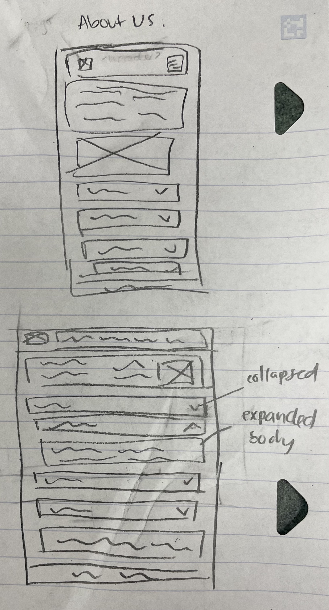
Explanation: There will be dropdowns that expand to reveal the content within that category. This reduces scrolling and groups information, to make it easier for users to find the information they want. It also promotes organization within the site.

Home Page:
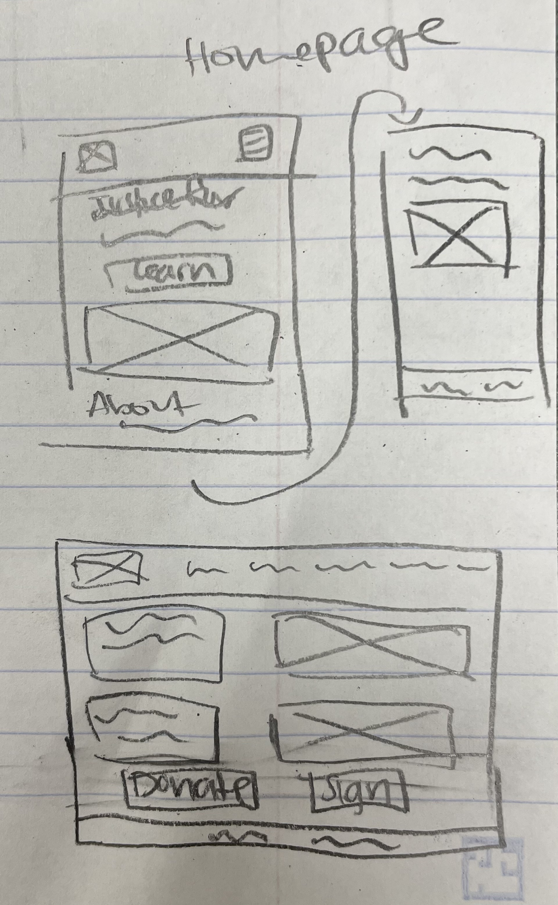
Explanation: there will be a hamburger menu which will be hidden when the window size is too small. It will consist of a button which, when clicked, drops down the navigation. When it is clicked again, it will collapse.

### Final Design (Milestone 2)
> Include the final sketches for each of your pages.
> **Include your final interactivity in your sketches.** Include annotations to explain what happens when the user takes an action with your interactivity.
> The sketches must include enough detail that another 1300 student could implement them.
> Please provide an explanation for each sketch.

**Narrow Design:**

Home Page:
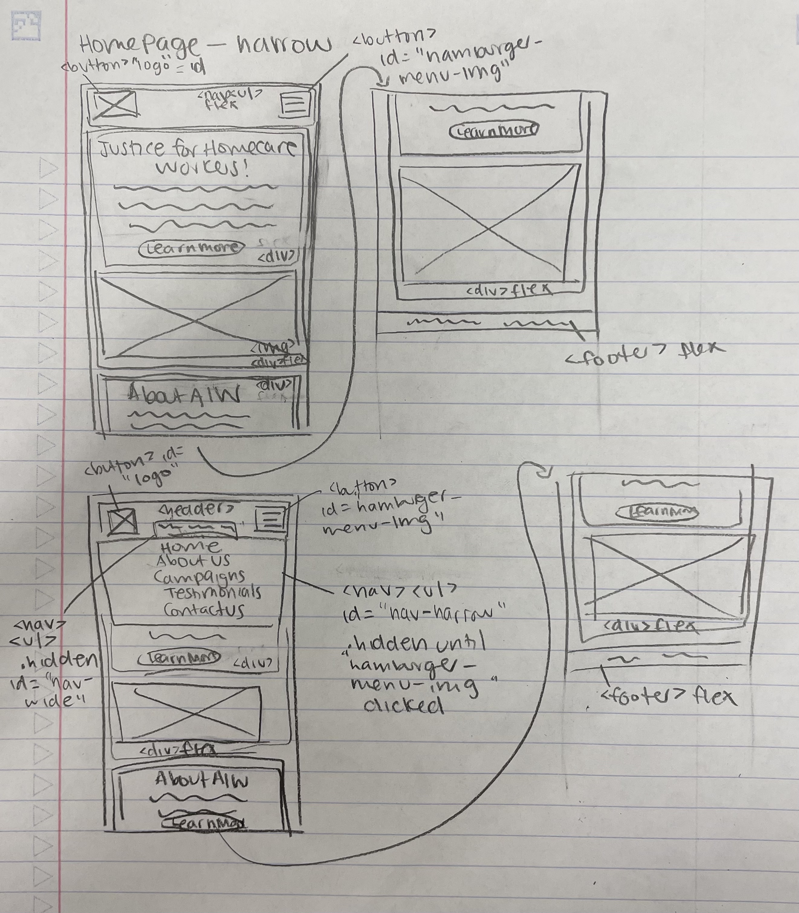
Explanation: This is the narrow view; we wanted to stack the images and the divs of text to make the narrow width accessible. We included everything from the wide layout because we know that we should keep content the same across widths.
EDIT: #nav-marrow and #nav-wide in this sketch are referring to the same element, the id should be #nav-menu (as seen in the Interactivity planning)

About Us Page:
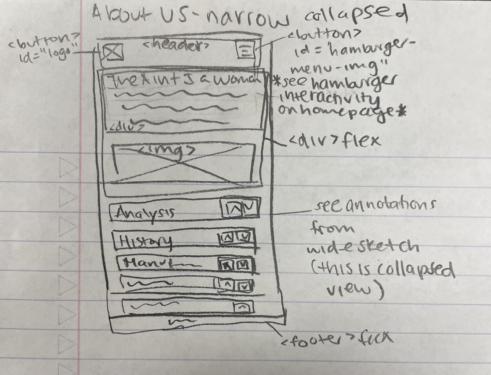
Explanation: This is the narrow view; the CSS classes and the HTML elements are the same for the narrow and the wide views, but this demonstrates the view of the page when the drop-downs are collapsed.

Campaigns Page:
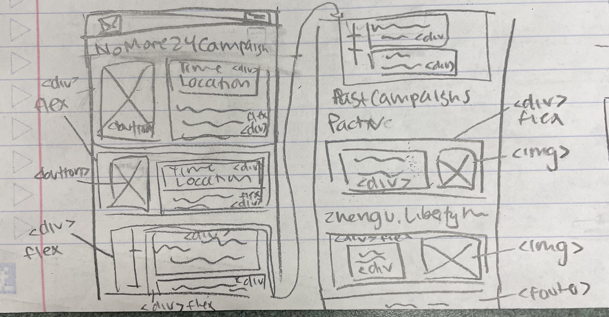
Explanation: We stacked the elements of this page to be more accessible and user-friendly for a narrow screen. There is a hamburger menu and the images take up the whole screen.

Testimonials Page:
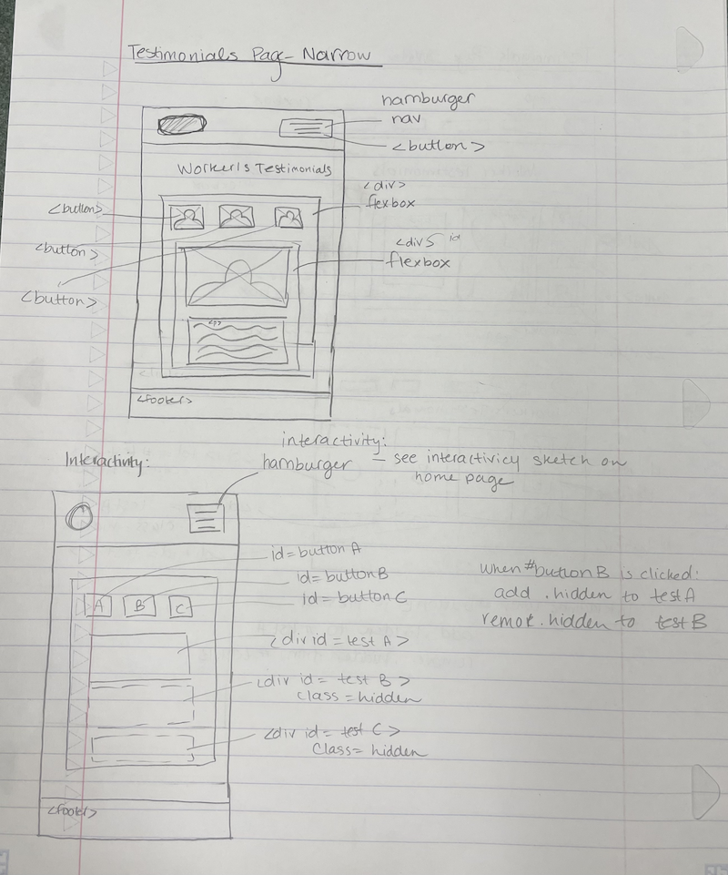
Explanation: The testimonials page features an interactive hamburger menu, a common design pattern on narrow screens, where the user can hide and open the stacked navigation menu to maximize visibility and minimize scrolling. It also features an interactive gallery to display worker testimonials. The user can click on images of workers and text and image testimonials are hidden or displayed based on the button that is pressed. This gallery is displayed in a vertical format so that the buttons and testimonials are stacked.

Contact Us Page:
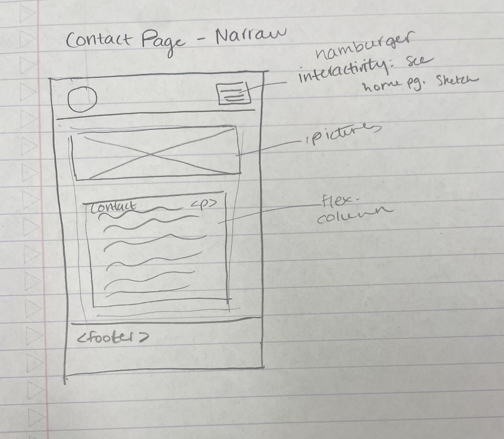
Explanation: This page contains a hamburger menu, a common design pattern on narrow screens. This contact page features a decorative image and a text contact with clickable links and resources to aid the user in getting involved in the organization. The image and the text are displayed in a stacked format.


**Wide Design:**

Home Page:
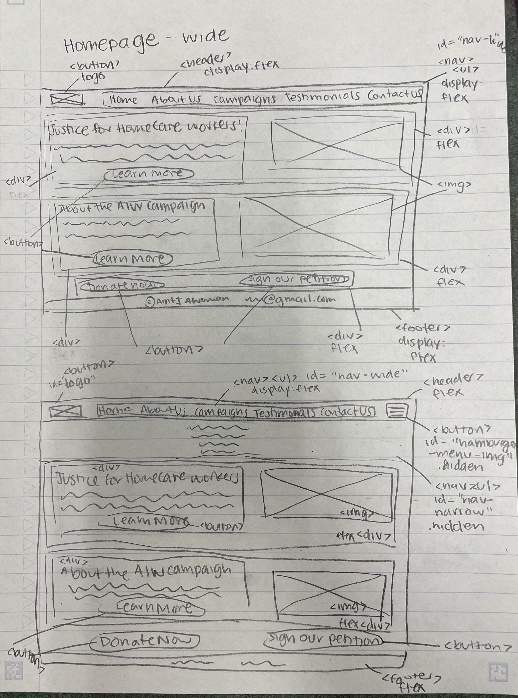
Explanation: Our homepage design is clean, short, and minimizes scrolling. This accomplishes what the client was hoping for in the redesigned homepage. It also includes the hidden class of the narrow hamburger elements in the navigation bar and the header; this is to denote that those elements exist but are not being shown when the window is too large. Also, the minimization in scrolling is helpful for the user, as they can now find information easily and are not overwhelmed by a large amount of text, since we moved the content into other pages, which are linked in buttons. This lack of heavy scrolling makes it easier for the user to identify groups of information and the links to the pages for more information. Typically, homepages are less content heavy, so this would fit well with the design pattern of a content-light homepage.
EDIT: #nav-marrow and #nav-wide in this sketch are referring to the same element, the ids should be #nav-menu ( as seen in the Interactivity planning)

EDIT: the clients requested that the hero image stay on the top of the page; so we will employ that into our development of the website coded. We also will not be using the button element for the "Learn More" content, we will instead be using it as a link to another page within the website.

About Us Page:
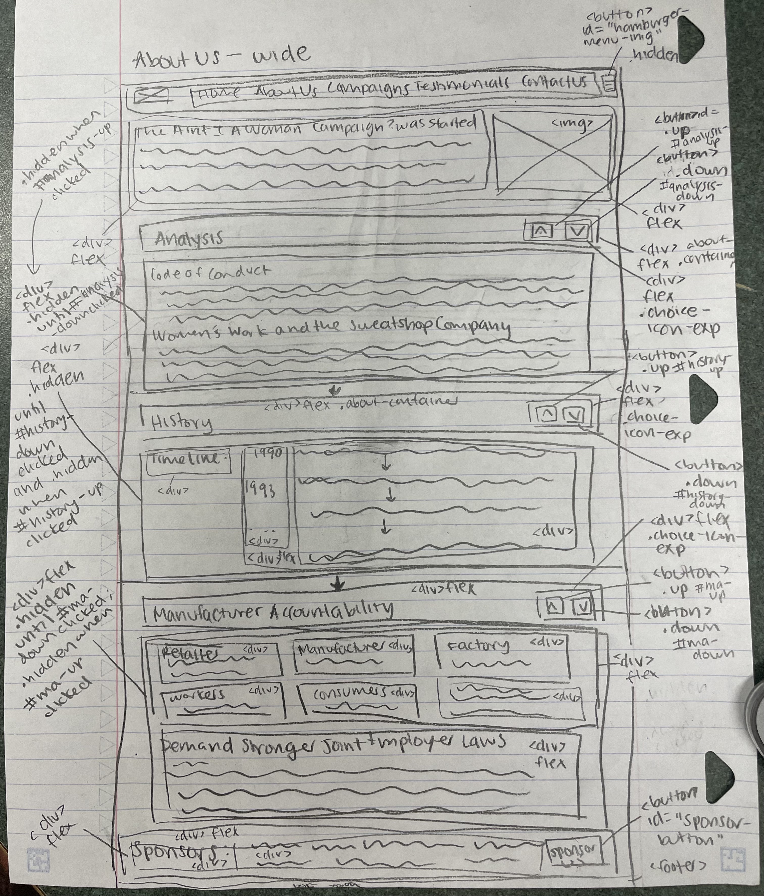
Explanation: The about us page has an initial overview statement and then has multiple drop-downs to have a large amount of content on a page while making it easy to find information and easily get rid of irrelevant information to a user's information journey. Within each, there is text, organized into multiple different layouts depending on the existing or intended meaning. For example, the timeline is structured like a timeline, with svgs of arrows (forgot to label them as imgs, but they are). The arrows going down indicate a new screen (since a wide screen cannot be displayed in full at this length).

EDIT: we will not be implementing the History dropdown as per our client's wishes. We also will make the cards within the manufacturer accountability container all within one row, side-by-side.

Campaigns Page:
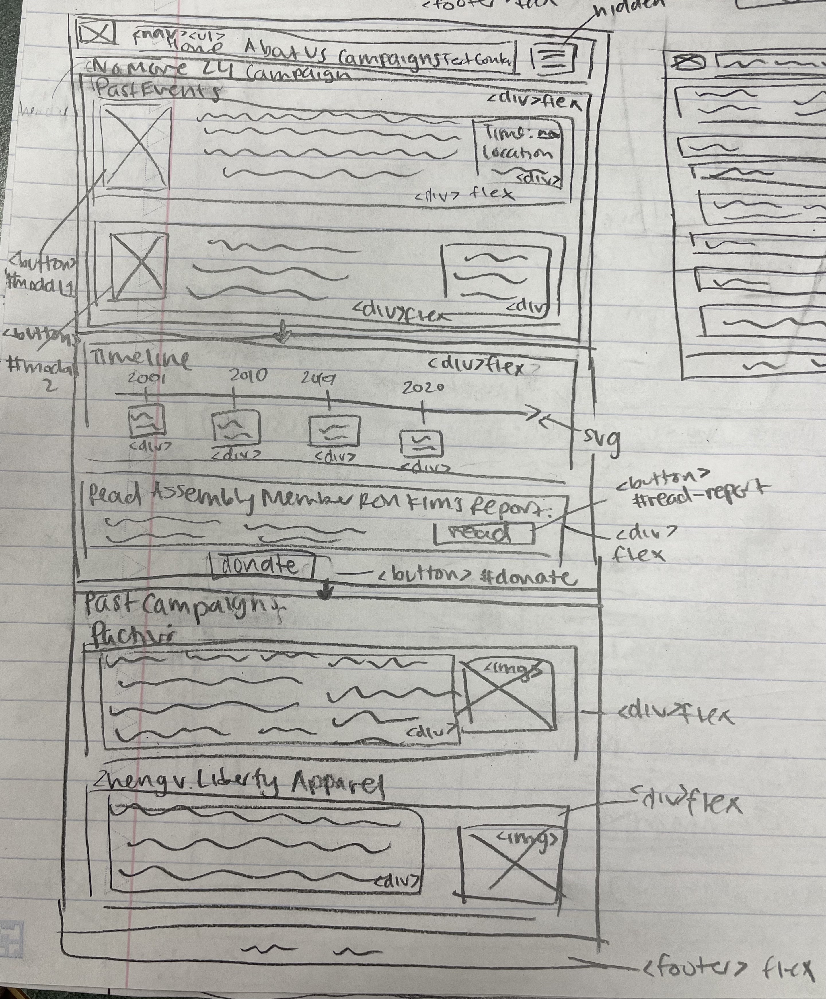
Explanation: The arrows going down indicate a new screen (since a wide screen cannot be displayed in full at this length). The page has multiple sections, the first being the current No More 24 campaign. We include, under this campaign, event information with modals of the images of the event posters when clicked on, a timeline of the campaign so far, and an assemblymember's report that was included. For the second section, we put the inactive campaigns (Pactiv and Zheng v. Liberty Appeal) and their information (a short summary) there.

EDIT: We neglected to draw the modals in the sketch. We will employ standard modal design, in which the image clicked (the buttons labeled #modal1 and #modal2) will elicit another container to appear above all of the contents on the page and graying out the underlying page. The container will house an image. There will be a close button next to the image, meaning that there will be a flexbox (column direction) with the x button on the upper right corner and the image on the left. This modal container will be named #modal-container1 and #modal-container2, respectively.

Testimonials Page:
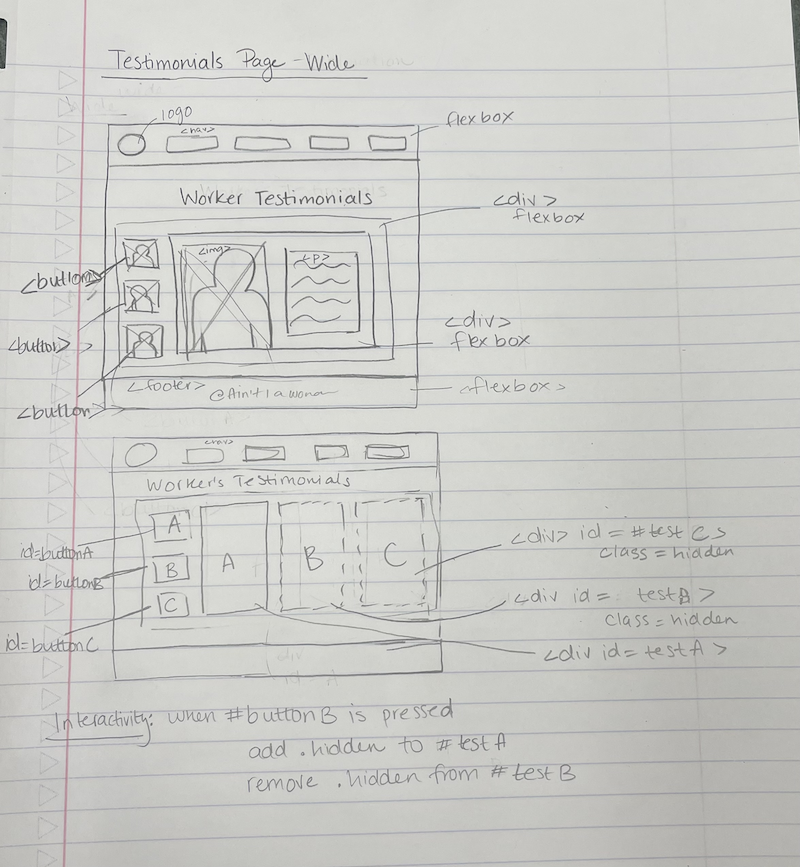
Explanation: The testimonials page features a horizontal navigation bar, a common design pattern on wide screens. It also features an interactive gallery to display worker testimonials. The user can click on images of workers--these images act as buttons-- and text and image testimonials are hidden or displayed based on the button that is pressed. This gallery is displayed horizontally so that the buttons and testimonials are displayed side by side.

EDIT: Instead of using images as buttons to create a thumbnail gallery, we only used text in the buttons per the client's request. Additionally, the we changed the sketch to include the buttons displayed above the testimonial, also as the client requested.


Contact Us Page:
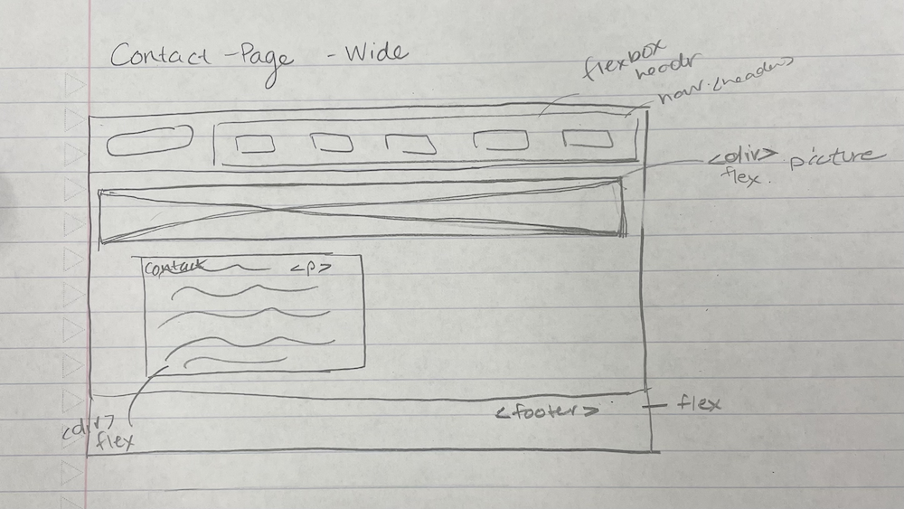
Explanation: The testimonials page features a horizontal navigation bar, a common design pattern on wide screens. This contact page features a decorative image and a text contact with clickable links and resources to aid the user in getting involved in the organization. The content is displayed in a row format using flex boxes.


### Design Rationale (Milestone 2)
> Explain why your design is appropriate for your audience.
> Specifically, why does your content organization, navigation, and site design/layout meet the goals of your users?
> How did you employ **design patterns** to improve the familiarity of the site for your audience?

Our design is carefully tailored to meet the specific needs and preferences of our target audience. To align with our client's wishes, we have maintained consistency with the current website's color scheme and font style, resulting in a design that's clean, and professional. Our design approach emphasizes content organization and intuitive navigation, prioritizing user goals of quickly accessing information. This design strategy places a strong emphasis on content differentiation, aiding our users in easily identifying and accessing the important information they are looking for. We have also implemented responsive design principles, ensuring that our website is accessible and user-friendly on both narrow and wide screens. By incorporating familiar design patterns, such as offering a horizontal or stacked navigation bar depending on the screen size, we aim to enhance the overall user experience, making it more efficient for users to find the information they seek.

## Interactivity Rationale (Milestone 2)
> Describe the purpose of your proposed interactivity.
> Provide a brief rationale explaining how your proposed interactivity addresses the goals of your site's audience and enhances their user experience.

The proposed interactivity elements in the website serve distinct purposes that significantly enhance the user experience and directly address the goals of the site's audience. The inclusion of a hamburger menu for narrow screens ensures improved navigation and visibility on smaller devices, providing a responsive design that caters to the mobile user experience. On the Campaigns Page, modals are employed to effectively highlight and streamline essential campaign information, allowing users to quickly access details. This feature aligns with the audience's goal of efficient information retrieval while engaging users with interactive content. The Testimonials Page's gallery with image-based buttons, revealing different testimonials upon click, adds a user-centric dimension, permitting users to view specific content without extensive scrolling. Finally, on the About Us page, drop-downs are utilized to efficiently present detailed information, promoting a structured exploration of campaign history and analysis, thus enhancing the user experience and encouraging expanded outreach.


## Interactivity Plan (Milestone 2)
> Now that you've designed your interactivity for your site, you need to plan how you will implement it.
> Describe how you will implement the interactivity. This should be a complete plan that another 1300 student could use to implement the interactivity.
> You should list the HTML elements, CSS classes, events, pseudocode, and the initial state.

Hamburger menu toggle (for narrow screens):
 ```
 if #hamburger-menu is clicked:
    if #nav-menu  has .accessible-hidden:
      remove .accessible-hidden from #nav-menu
    else:
      add .accessible-hidden to #nav-menu
 ```

 Hamburger button and Menu display (width resizing):
 ```
 if width is resized to narrow screen width:
    remove .accessible-hidden from #hamburger-menu
    add .accessible-hidden to #nav-menu

  if width is resized to wide screen width:
    add .accessible-hidden to #hamburger-menu
    remove .accessible-hidden from #nav-menu
 ```

 Testimonial gallery:
 ```
 if #buttonA is clicked:
  remove .hidden from #testA
  add .hidden to #testB
  add .hidden to #testC
if #buttonB is clicked:
  remove .hidden from #testB
  add .hidden to #testC
  add .hidden to #testA
if #buttonC is clicked:
  remove .hidden from #testC
  add .hidden to #testA
  add .hidden to #testB
```

Campaigns modals -open and close:
```
when #modal1 is clicked:
  remove .hidden from
when #close1 is clicked:
  add .hidden to

when #modal2 is clicked:
  remove .hidden from
when #close2 is clicked:
  add .hidden to

```

About dropdown-open and close:
```
if #analysis-up clicked:
  add .accessible-hidden to #analysis-container
  add .hidden to #analysis-up
  remove .hidden from #analysis-down

if #analysis-down clicked:
  add .hidden to #analysis-down
  remove .hidden #
  remove .accessible-hidden from #analysis-container
  remove .hidden from #analysis-up
  add .hidden to #analysis-down

if #history-up is clicked:
  add .accessible-hidden to #history-container
  add .hidden to #history-up
  remove .hidden from #history-down

if #history-down is clicked:
  remove .accessible-hidden from #history-container
  remove .hidden from #history-up
  add .hidden to #history-down

if #man-acc-up is clicked:
  add .accessible-hidden to #man-acc-container
  add .hidden to #man-acc-up
  remove .hidden from #man-acc-down

if #man-acc-down is clicked:
  remove .accessible-hidden from #man-acc-container
  remove .hidden from #man-acc-up
  add .hidden to #man-acc-down

```

NOTE: we will not be implementting a history dropdown as per the client's instructions, so we will not be implementing JavaScript for it.


## Client Feedback & Minutes (Milestone 2)
> You should meet with your client again to obtain feedback on your design.
> Provide a summary of the client's feedback and your meeting's minutes.

- Likes the design
- Thinks the homepage is much more user-friendly (less scrolling)
- Would like the dropdowns to be some blue color
- No need to do the timeline for the about us page; doing away with the history page
- Want to have cards in the manufacturer accountability side-by-side
- Want to keep the hero image at the top of the home page
- Said that including images in the thumbnail gallery was not needed, instead use the names of the workers only
- Would like to have the buttons displayed above the testimonial instead of side-by-side.

20 minutes


## User Testing (Final Submission)

**Conduct user testing with a minimum of 1 participant for every member of your team.**

### User Testing Tasks (Final Submission)
> Plan out your user testing tasks before doing your user testing.
> These must be actual user testing tasks.
> **Tasks are not questions!**

1. Please find information about the history of the campaign.

2. Navigate to the About page. Now please identify the groups of related content that you can see.

3. Find the information you would use to introduce someone to AIW.

4. Please find information about current and past campaigns of AIW.

5. Please locate the contact information for AIW.

6. Please find the testimonial from Álvaro Ramírez.


### Participant 1 (Final Submission)
> Using your notes from above, describe your user by answering the questions below.

1. Who is your user, e.g., where does the user come from, what is the user's job, characteristics, etc.?

My user is a Binghamton University undergraduate. He is pretty proficient in technology / computers.

2. Does the user belong to your audience of the site?

    > If “No”, what’s your strategy of associating the user test results to your audience’s needs and wants? How can your re-design choices based on the user tests make a better fit for the audience?

Yes, he is. He is because he is representative of the "interested everyday citizens" category of our audience.

### Participant 1 -- Testing Notes (Final Submission)
> When conducting user testing, you should take notes during the test.

- Able to find pages very quickly
- Interactivity is functional
- Able to differentiate groups on the About page
- Chose to look at the About page for the introduction to AIW prompt
- Able to locate Álvaro Ramírez testimonial
- Went to campaigns page for the cmmpaigns prompt

### Participant 2 (Final Submission)
> Using your notes from above, describe your user by answering the questions below.

1. Who is your user, e.g., where does the user come from, what is the user's job, characteristics, etc.?

My participant is a marine biologist from California. They are familiar with AIW and regularly volunteer with them.

1. Does the user belong to your audience of the site?

    > If “No”, what’s your strategy of associating the user test results to your audience’s needs and wants? How can your re-design choices based on the user tests make a better fit for the audience?

Yes, they are, since one of the audiences we have involves people who are volunteering and involved with AIW.

### Participant 2 -- Testing Notes (Final Submission)
> When conducting user testing, you should take notes during the test.

- Able to get to all pages relatively fast
- Chose to look at the homepage for the history of AIW prompt
- Confused about which campaign the paste events section was about
- Able to differentiate groups on About page

### Participant 3 (Final Submission)
> Using your notes from above, describe your user by answering the questions below.

1. Who is your user, e.g., where does the user come from, what is the user's job, characteristics, etc.?

They are a middle aged activist who is becoming interested in AIW and wants to research the campaign.

1. Does the user belong to your audience of the site?

    > If “No”, what’s your strategy of associating the user test results to your audience’s needs and wants? How can your re-design choices based on the user tests make a better fit for the audience?

Yes, they are because they are an interested non-AIW-involved person.

### Participant 3 -- Testing Notes (Final Submission)
> When conducting user testing, you should take notes during the test.

- Flickering of website navigation when resized
- Able to use all interactive components
- Quickly found testimony of Álvaro Ramírez
- Chose to look at About page for AIW history info

NOTE: we did not do four user interviews because Andy did not contribute to our project and was responsible for completing a user interview.

## Website Revision Based on User Testing (Final Submission)
> What changes did you make to your design based on user testing?

- Fixed the flickering of the nav bar when page is resized
- Added a h1 to the campaigns page denoting which campaign the "past events" section is about

## Grading (Final Submission)

### Collaborators (Final Submission)
> List any persons you collaborated with on this project.

The only contributors to this project were Sonia Mar, Huanran Li, and Neha Arora.

### Reference Resources (Final Submission)
> Please cite any external resources you referenced in the creation of your project.
> (i.e. tutorials, W3Schools, StackOverflow, Mozilla, etc.)

We used Mozilla Reference Documentation for HTML and CSS.
